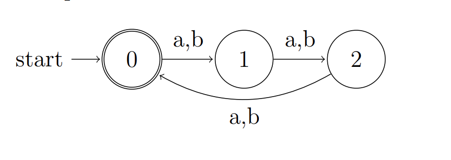
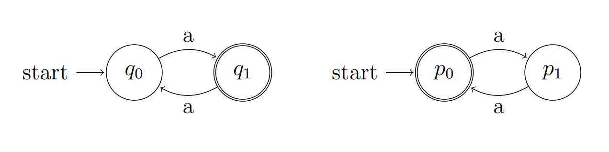
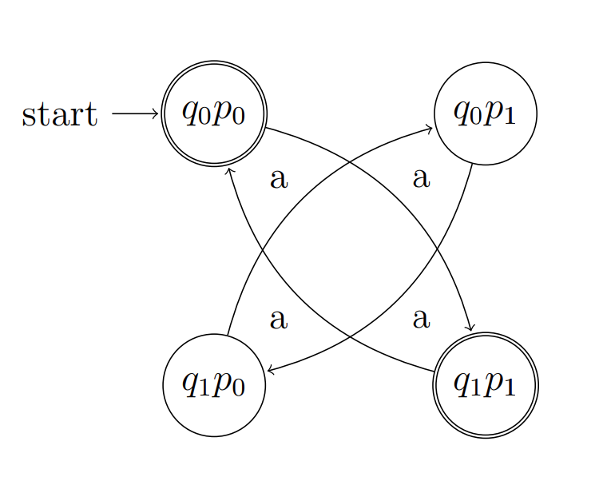

# Group Project COS284 2023

- #### TeamnameHere

    - Ofentse Ramothibe (Group Leader)
    - SelenatorXO (add names)
    - Selepe Sello
    - Tiyiso Hlungwani

- ###### Module: COS284 (Computer Organisation and Architecture)

- ###### Due Date: 05 November 2023, 22:30

- ###### Best Mark:  00 / 100

- ###### Directories:

    - C-Code: ./Project/Implementation_in_C/files_here
    - Assembly-Code: ./Project/NASM_x86-64_Code/files_here


---
---

## Section A: Background

- The COS210 faculty initiated a project with student developers to design a program for Deterministic Finite Automata (DFA). This program would allow lecturers to define a DFA in a file, which the program could then construct and simulate with input strings. Regrettably, the initial team of developers did not complete the project and the lecturers are unsure of its accuracy.  They have now expressed a preference for assembly language.
- The task is to finalize this project in three stages, with each subsequent stage building on the former. Ensure you begin promptly.

---

###### NB:= Remove the (*) for Completed Sections Below

---

## Section B: Deliverable 1 (*)

- We first need to construct a DFA. The DFA will be specified in a file, and our program will read the file to build the DFA.
- The structures used will be as follows
    ```C
    // State
    typedef  struct {
        int id;
        bool  isAccepting;
    };
    // Transition
    typedef  struct {
        int  from;
        int to;
        char  symbol;
    };
    // DFA
    typedef  struct {
        State *states;
        Transition *transitions;
        int  numStates;
        int  numTransitions;
        int  startState;
    }
    ```

- The DFA will be specified in a file with the following format:
    ```text
    3,6
    0,1,2
    0
    0,1,a
    0,1,b
    1,2,a
    1,2,b
    2,0,a
    2,0,b
    ```

    - The first line specifies the `number of states` and `transitions`, respectively.
    - The second line specifies the `IDs` of the states.
    - The third line specifies the `IDs` of the `accepting` states. Also comma separated.
    - The remaining lines specify the `transitions`. Each line has the format `from`, `to`, symbol.
    - The starting state is `always` 0.

- We will need to implement the following interface:
    ```C
    DFA* readDfa(const  char *filename)
    ```
    - This function will read the file and construct the DFA. It will return a pointer to the DFA. If the file does not exist, or the file is not formatted correctly, the function will return NULL.
    - An example of how to use this function is as follows:
        ```C
        DFA* dfa = readDfa("dfa.txt");
        ```
    - Where the DFA using the file specified above would look like this:

        

    - Take note that there are 6 transitions in this DFA as previously specified.

## Section B: Deliverable 2 (*)

- Now that we can construct DFA, we need to be able to simulate input strings over them.
- We will do this by implementing the following interface:
    ```C
    bool  simulateDfa(DFA *dfa, const char *inputString);
    ```

- This function will simulate the input string over the DFA. If the DFA accepts the string,the function will return true, otherwise it will return false.
- An example of how to use this function is as follows:
    ```C
    DFA* dfa = readDfa("dfa.txt");
    bool accepted = simulateDfa(dfa, "ababab");
    ```

- And assuming the DFA is the same as the one specified in the previous deliverable, the output would be true. It is up to us to figure out how boolean values work in C and how to use them in assembly. The input strings will be C strings.

## Section C: Deliverable 3 (*)

- Now that we can construct DFA and simulate input strings over them, we need to be able to check if two DFA represent the same language.
-  We will do this by implementing the following interface:
    ```C
    bool  sameLanguage(DFA* dfa1, DFA* dfa2);
    ```

- This function will return true if the two DFA represent the same language, otherwise it will return false.
- An example of how to use this function is as follows:
    ```C
    DFA* dfa1 = readDfa("dfa1.txt");
    DFA* dfa2 = readDfa("dfa2.txt");
    bool same = sameLanguage(dfa1, dfa2);
    ```

- There are different approaches to verifying this. An example approach will be listed below in `Section D`, however, it is quite a lengthy process and you are free to implement your own approach.

## Section D: Example Approach

- ##### Algorithm to Check if Two DFAs Accept the Same Language

    - Given two deterministic finite automata (DFAs) A<sub>1</sub> and A<sub>2</sub>, we construct a new DFA A<sub>d</sub> to determine whether A<sub>1</sub> and A<sub>2</sub> accept the same language.

- ##### Formal Definitions

    Let A<sub>1</sub> and A<sub>2</sub> have the following components:
    - Q₁, Q₂:  The sets of states in A₁ and A₂, respectively.
    - Σ:  The alphabet.
    - δ₁, δ₂:  The transition functions, δ₁: Q₁×Σ→Q₁ and δ₂: Q₂×Σ→Q₂.
    - F₁, F₂:  The sets of accepting states in A₁ and A₂, respectively.

- ##### Constructing A_d

    - States: Qₖ = Q₁ × Q₂
    - Alphabet: Σₖ = Σ
    - Transition Function: δₖ: Qₖ × Σₖ → Qₖ defined by δₖ((q₁, q₂), σ) = (δ₁(q₁, σ), δ₂(q₂, σ))
    - Accepting States: Fₖ contains all pairs (q₁, q₂) where q₁ ∈ F₁ and q₂ ∉ F₂, or q₁ ∉ F₁ and q₂ ∈ F₂.

- ##### Algorithm

    - To determine if A₁ and A₂ accept the same language, we explore Aₖ from its initial state (q₁₍ᵢₙᵢₜ₎, q₂₍ᵢₙᵢₜ₎). If we ever reach an accepting state in Aₖ, A₁ and A₂ do not recognize the same language. Otherwise, they do.


    - Consider two DFAs, A₁ and A₂, defined as follows:

        

    - Combined DFA Aₖ:

        


---
---

## Section E: Minimum Requirements

- #### `Requirements before running codes`:
    - Install an `IDE` that `compiles` and `runs` Assembly codes. Recommendation `VS Code`
    - How to setup `WSL` Ubuntu terminal shell and run it from `Visual Studio Code`: [Visit-Link](https://www.youtube.com/watch?v=fp45HpZuhS8&t=112s)
    - Installing `NASM` / How to Run NASM Code in `Windows`: [Visit-Link](https://youtu.be/pL6u5Ieg86A?feature=shared)

---

- #### `Makefile`

    - A makefile is included to compile and run the codes on the terminal with the following commands:=
        - make clean
        - make
        - make run
    - Makefile:
        ```assembly
            ASM_SOURCES := $(wildcard src/*.asm *.asm)
            C_TEST_SOURCES := main.c del1.c del2.c del3.c
            SRC_DIR := src
            OBJ_DIR := .
            BIN_DIR := .
            EXECUTABLE := $(BIN_DIR)/test
            ASM_OBJECTS := $(addprefix $(OBJ_DIR)/, $(notdir $(ASM_SOURCES:.asm=.o)))
            C_TEST_OBJECTS := $(addprefix $(OBJ_DIR)/, $(notdir $(C_TEST_SOURCES:.c=.o)))

            all: $(OBJ_DIR) $(BIN_DIR) $(EXECUTABLE)

            $(EXECUTABLE): $(ASM_OBJECTS) $(C_TEST_OBJECTS)
                gcc -no-pie -g -m64 -o $@ $^

            $(OBJ_DIR)/%.o: %.asm
                yasm -f elf64 -g dwarf2 $< -o $@

            $(OBJ_DIR)/%.o: %.c
                gcc -g -m64 -c $< -o $@

            $(OBJ_DIR):
                mkdir -p $(OBJ_DIR)

            run: $(EXECUTABLE)
                ./$(EXECUTABLE)

            debug: $(EXECUTABLE)
                gdb $(EXECUTABLE)

            clean:
                rm -f $(ASM_OBJECTS) $(C_TEST_OBJECTS) $(EXECUTABLE)
                reset
                clear

            fresh: clean all

            tar:
                tar -cvz *.asm -f Code.tar.gz
        ```

---

---

<p align="center">The End, Thank You</p>

---
